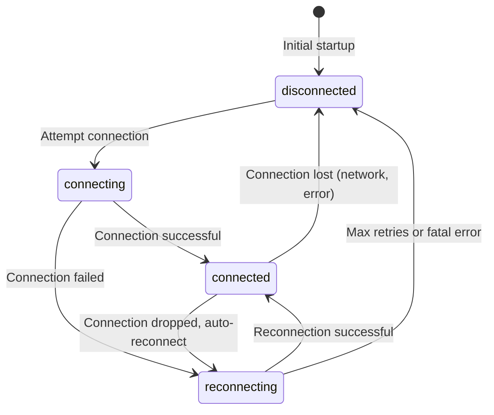

# Data Model: Gmail IMAP Email Monitor

**Feature**: 001-gmail-imap-monitor
**Date**: 2025-11-01
**Purpose**: Define data structures for email storage and state management

## Overview

This document defines two primary data models:

1. **Email Record** - SQLite database schema for storing email messages
2. **Connection State** - JSON file schema for tracking monitor status

Both models are derived from requirements FR-003 (email fields) and FR-004 (state fields).

---

## 1. Email Record (SQLite Database)

### Database: `emails.db`

**Location**: `./data/emails.db` (configurable via `DB_PATH` environment variable)

**Configuration**:
- **Journal Mode**: WAL (Write-Ahead Logging) for better concurrency
- **Synchronous**: NORMAL (balance between safety and performance)
- **Foreign Keys**: OFF (no relationships in this schema)

### Table: `emails`

#### Schema Definition

```sql
CREATE TABLE IF NOT EXISTS emails (
  id INTEGER PRIMARY KEY NOT NULL,
  from_address TEXT NOT NULL,
  to_address TEXT NOT NULL,
  cc_address TEXT,
  subject TEXT NOT NULL,
  body TEXT NOT NULL,
  received_at TEXT NOT NULL,
  labels TEXT NOT NULL,
  downloaded_at TEXT NOT NULL
);

-- Indexes for performance
CREATE INDEX IF NOT EXISTS idx_received_at ON emails(downloaded_at);
CREATE INDEX IF NOT EXISTS idx_from_address ON emails(from_address);
```

#### Field Definitions

| Field | Type | Constraints | Description | Validation Rules |
|-------|------|-------------|-------------|------------------|
| `id` | INTEGER | PRIMARY KEY, NOT NULL | IMAP id - unique identifier for email in mailbox | Must be positive integer; uniqueness enforced by primary key |
| `from_address` | TEXT | NOT NULL | Sender email address | Must not be empty; store full address (e.g., "Name &lt;email@example.com&gt;") |
| `to_address` | TEXT | NOT NULL | Recipient email address(es) | Must not be empty; comma-separated if multiple; store full addresses |
| `cc_address` | TEXT | NULLABLE | CC recipient email address(es) | May be NULL or empty string; comma-separated if multiple |
| `subject` | TEXT | NOT NULL | Email subject line | May be empty string if email has no subject (edge case) |
| `body` | TEXT | NOT NULL | Email body content (plain text or HTML) | May be empty string if email has no body (edge case); prioritize plain text, fallback to HTML |
| `received_at` | TEXT | NOT NULL | Original sent date/time from email headers | ISO 8601 format (e.g., "2025-11-01T10:30:45.123Z"); extracted from email Date header |
| `labels` | TEXT | NOT NULL | Gmail labels/folders as JSON array | Valid JSON array string (e.g., '["INBOX", "IMPORTANT"]'); empty array if no labels: '[]' |
| `downloaded_at` | TEXT | NOT NULL | Timestamp when email was received by local IMAP client | ISO 8601 format (e.g., "2025-11-01T10:30:45.123Z"); generated at time of local storage |

#### Indexes

1. **Primary Key Index** (`id`):
   - Purpose: Fast id lookups for duplicate detection (FR-009)
   - Use case: Check if email already exists before insertion
   - Automatically created by PRIMARY KEY constraint

2. **Chronological Index** (`idx_received_at`):
   - Purpose: Efficient chronological queries (FR-002 requirement)
   - Use case: Retrieve emails in order of receipt, time-based filtering
   - Created explicitly as per requirements

3. **Sender Index** (`idx_from_address`):
   - Purpose: Fast queries by sender
   - Use case: Future functionality for filtering/searching by sender
   - Added for anticipated query patterns

#### Data Validation

**At Application Layer** (before insertion):

```javascript
function validateEmailRecord(email) {
  // id validation
  if (!Number.isInteger(email.id) || email.id <= 0) {
    throw new Error('id must be a positive integer');
  }

  // Required text fields
  if (!email.from_address || typeof email.from_address !== 'string') {
    throw new Error('from_address is required');
  }
  if (!email.to_address || typeof email.to_address !== 'string') {
    throw new Error('to_address is required');
  }

  // Subject and body can be empty strings but not null/undefined
  if (email.subject === null || email.subject === undefined) {
    email.subject = '';  // Normalize to empty string
  }
  if (email.body === null || email.body === undefined) {
    email.body = '';  // Normalize to empty string
  }

  // Labels must be valid JSON array
  if (email.labels) {
    try {
      const parsed = JSON.parse(email.labels);
      if (!Array.isArray(parsed)) {
        throw new Error('labels must be a JSON array');
      }
    } catch (e) {
      throw new Error('labels must be valid JSON array string');
    }
  } else {
    email.labels = '[]';  // Default to empty array
  }

  // Date validation (ISO 8601)
  if (!email.received_at || !isValidISO8601(email.received_at)) {
    throw new Error('received_at must be ISO 8601 format');
  }
  if (!email.downloaded_at || !isValidISO8601(email.downloaded_at)) {
    throw new Error('downloaded_at must be ISO 8601 format');
  }

  return email;
}
```

#### Sample Records

**Example 1: Typical Email**
```json
{
  "id": 12345,
  "from_address": "John Doe <john.doe@example.com>",
  "to_address": "recipient@gmail.com",
  "cc_address": "cc1@example.com, cc2@example.com",
  "subject": "Meeting Tomorrow",
  "body": "Hi,\n\nLet's meet at 2pm tomorrow.\n\nBest,\nJohn",
  "received_at": "2025-11-01T10:30:45.000Z",
  "labels": "[\"INBOX\", \"IMPORTANT\"]",
  "downloaded_at": "2025-11-01T10:30:48.123Z"
}
```

**Example 2: Edge Case - No Subject, No CC**
```json
{
  "id": 12346,
  "from_address": "noreply@service.com",
  "to_address": "recipient@gmail.com",
  "cc_address": null,
  "subject": "",
  "body": "Your verification code is 123456",
  "received_at": "2025-11-01T11:00:00.000Z",
  "labels": "[\"INBOX\"]",
  "downloaded_at": "2025-11-01T11:00:02.456Z"
}
```

**Example 3: Edge Case - HTML Body, Multiple Labels**
```json
{
  "id": 12347,
  "from_address": "Newsletter <news@company.com>",
  "to_address": "recipient@gmail.com",
  "cc_address": null,
  "subject": "Weekly Update",
  "body": "<html><body><h1>Welcome</h1><p>This week's news...</p></body></html>",
  "received_at": "2025-11-01T12:00:00.000Z",
  "labels": "[\"INBOX\", \"CATEGORY_PROMOTIONS\", \"UNREAD\"]",
  "downloaded_at": "2025-11-01T12:00:03.789Z"
}
```

---

## 2. Connection State (JSON File)

### File: `current_state.json`

**Location**: `./data/current_state.json` (configurable via `STATE_FILE_PATH` environment variable)

**Purpose**: Track IMAP connection status and synchronization position for recovery and monitoring

### Schema Definition

```typescript
interface ConnectionState {
  last_id: number;                      // Highest id processed
  last_id_received_at: string;          // ISO 8601 timestamp
  last_connected_at: string;             // ISO 8601 timestamp
  last_error: string | null;             // Error message or null
  connection_status: ConnectionStatus;   // Enum: connected | reconnecting | disconnected
}

type ConnectionStatus = 'connected' | 'reconnecting' | 'disconnected';
```

### Field Definitions

| Field | Type | Description | Validation Rules | Update Trigger |
|-------|------|-------------|------------------|----------------|
| `last_id` | number | Highest id processed and stored in database | Must be non-negative integer; 0 if no emails processed yet | After each successful email insertion (FR-005) |
| `last_id_received_at` | string | Timestamp when `last_id` email was received locally | ISO 8601 format; must match `downloaded_at` of email with `last_id` | After each successful email insertion (FR-005) |
| `last_connected_at` | string | Last successful IMAP connection timestamp | ISO 8601 format | On successful connection or reconnection |
| `last_error` | string \| null | Most recent error message; null if no error | Any string or null; cleared on successful recovery | On any error (connection, parsing, storage) (FR-005) |
| `connection_status` | string | Current connection state | Must be one of: `"connected"`, `"reconnecting"`, `"disconnected"` | On any connection state change (FR-005) |

### State Transitions



### Update Policy

**Immediate Writes** (FR-005):
1. **After each email processed**: Update `last_id` and `last_id_received_at`
2. **On connection state change**: Update `connection_status` and `last_connected_at` (if connecting)
3. **On error**: Update `last_error` and `connection_status`
4. **On successful recovery**: Clear `last_error` (set to null)

**Write Implementation**:
- Atomic file writes: Write to temporary file, then rename (prevents corruption)
- Synchronous writes (using `fs.writeFileSync`) to ensure state consistency
- Pretty-printed JSON (2-space indent) for human readability

### Sample States

**Example 1: Healthy Connected State**
```json
{
  "last_id": 12347,
  "last_id_received_at": "2025-11-01T12:00:03.789Z",
  "last_connected_at": "2025-11-01T10:00:00.000Z",
  "last_error": null,
  "connection_status": "connected"
}
```

**Example 2: Initial Startup (No Emails Yet)**
```json
{
  "last_id": 0,
  "last_id_received_at": "1970-01-01T00:00:00.000Z",
  "last_connected_at": "2025-11-01T10:00:00.000Z",
  "last_error": null,
  "connection_status": "connected"
}
```

**Example 3: Reconnecting After Error**
```json
{
  "last_id": 12340,
  "last_id_received_at": "2025-11-01T09:30:00.000Z",
  "last_connected_at": "2025-11-01T09:00:00.000Z",
  "last_error": "Connection timeout: ETIMEDOUT",
  "connection_status": "reconnecting"
}
```

**Example 4: Disconnected with Auth Error**
```json
{
  "last_id": 12340,
  "last_id_received_at": "2025-11-01T09:30:00.000Z",
  "last_connected_at": "2025-11-01T09:00:00.000Z",
  "last_error": "Authentication failed: Invalid credentials",
  "connection_status": "disconnected"
}
```

### Initial State (First Run)

When `current_state.json` doesn't exist, create with:

```json
{
  "last_id": 0,
  "last_id_received_at": "1970-01-01T00:00:00.000Z",
  "last_connected_at": "1970-01-01T00:00:00.000Z",
  "last_error": null,
  "connection_status": "disconnected"
}
```

---

## 3. Data Relationships

### Entity Relationship

```text
┌─────────────────────┐
│   Connection State  │
│   (current_state)   │
│                     │
│ - last_id ─────────┼──────┐
│ - connection_status │      │ References (logical, not FK)
│ - last_error        │      │
└─────────────────────┘      │
                              │
                              ▼
                    ┌─────────────────────┐
                    │    Email Record     │
                    │      (emails)       │
                    │                     │
                    │ - id (PK) ◄────────┤
                    │ - from_address      │
                    │ - subject           │
                    │ - body              │
                    │ - downloaded_at       │
                    │ - labels            │
                    └─────────────────────┘
```

**Relationship**: `Connection State.last_id` logically references `Email Record.id`
- Not enforced as foreign key (different storage mechanisms)
- Application ensures consistency: `last_id` always exists in `emails` table
- Used for recovery: On reconnection, fetch UIDs greater than `last_id` (FR-008)

---

## 4. Data Operations

### Core Operations

#### 1. Insert Email (with Duplicate Prevention)

```sql
-- Check if email exists
SELECT 1 FROM emails WHERE id = ? LIMIT 1;

-- If not exists, insert
INSERT INTO emails (
  id, from_address, to_address, cc_address, subject,
  body, received_at, labels, downloaded_at
) VALUES (?, ?, ?, ?, ?, ?, ?, ?, ?);
```

**Application Logic**:
```javascript
function storeEmail(db, email) {
  const exists = db.prepare('SELECT 1 FROM emails WHERE id = ?').get(email.id);
  if (exists) {
    logger.warn('Duplicate email detected', { id: email.id });
    return false;  // Skip duplicate (FR-009)
  }

  const stmt = db.prepare(`
    INSERT INTO emails (id, from_address, to_address, cc_address,
                         subject, body, received_at, labels, downloaded_at)
    VALUES (?, ?, ?, ?, ?, ?, ?, ?, ?)
  `);

  stmt.run(
    email.id,
    email.from_address,
    email.to_address,
    email.cc_address,
    email.subject,
    email.body,
    email.received_at,
    email.labels,
    email.downloaded_at
  );

  return true;
}
```

#### 2. Update Connection State

```javascript
function updateState(stateFilePath, updates) {
  const state = readState(stateFilePath);
  const newState = { ...state, ...updates };

  // Atomic write: temp file + rename
  const tempPath = `${stateFilePath}.tmp`;
  fs.writeFileSync(tempPath, JSON.stringify(newState, null, 2));
  fs.renameSync(tempPath, stateFilePath);

  return newState;
}
```

#### 3. Sync Missed Emails (Post-Reconnection)

```javascript
async function syncMissedEmails(imapClient, db, stateManager) {
  const state = stateManager.readState();
  const lastId = state.last_id;

  // Fetch UIDs greater than last_id (FR-008)
  const uids = await imapClient.search(['id', `${lastId + 1}:*`]);

  logger.info('Syncing missed emails', { count: uids.length, lastId });

  // Batch fetch and store
  for (const id of uids) {
    const email = await imapClient.fetchEmail(id);
    const stored = storeEmail(db, email);

    if (stored) {
      stateManager.updateState({
        last_id: email.id,
        last_id_received_at: email.downloaded_at,
        last_error: null,
      });
    }
  }

  logger.info('Sync complete', { emailsSynced: uids.length });
}
```

#### 4. Query Recent Emails (Chronological)

```sql
SELECT id, from_address, subject, downloaded_at
FROM emails
ORDER BY downloaded_at DESC
LIMIT 100;
```

#### 5. Count Total Emails

```sql
SELECT COUNT(*) as total FROM emails;
```

---

## 5. Error Handling

### Database Errors

| Error Type | Handling Strategy | Recovery |
|------------|-------------------|----------|
| Unique constraint violation (duplicate id) | Log warning, skip email, continue | No recovery needed (duplicate prevention working) |
| Database locked | Retry with exponential backoff (WAL mode reduces this) | Retry up to 3 times with 100ms, 200ms, 400ms delays |
| Database corruption | Log error, attempt recovery with `.recover`, continue monitoring | May lose corrupted email; don't crash (FR-014) |
| Disk full | Log critical error, pause insertions, continue monitoring | User must free space; monitor resumes when space available |

### State File Errors

| Error Type | Handling Strategy | Recovery |
|------------|-------------------|----------|
| File not found (first run) | Create with initial state | Normal operation |
| Corrupted JSON | Log error, restore from backup or use initial state | Lose state history but continue operation |
| Write failure (permissions) | Log critical error, continue in-memory state tracking | User must fix permissions; state not persisted |

---

## 6. Performance Considerations

### SQLite Optimization

1. **Prepared Statements**: Reuse for all INSERT/SELECT operations (5-10x faster)
2. **WAL Mode**: Allows concurrent reads during writes
3. **Batch Insertions**: Use transactions when syncing multiple emails
4. **Index Strategy**: Balance query performance vs. insert overhead (current indexes are minimal)

### Performance Targets (from Success Criteria)

- **SC-001**: Email storage latency <5 seconds total (IMAP fetch + parse + DB insert)
- **SC-006**: 100 emails/day = ~1 email every 15 minutes (well within capacity)
- **SC-013**: Support 10,000+ emails without degradation

**Expected Performance**:
- Single email insert: <10ms (better-sqlite3 synchronous)
- Batch insert (100 emails): <500ms with transaction
- Query by id: <1ms (primary key lookup)
- Query recent 100 emails: <10ms (indexed scan)

### Memory Footprint

- **Database**: ~1KB per email (text-heavy) × 10,000 = ~10MB
- **State file**: <1KB
- **Application**: ~50MB base + connections
- **Total**: <100MB (meets constraint)

---

## 7. Schema Migration Strategy

**Current Version**: 1.0.0 (initial schema)

**Future Migrations** (if needed):
1. Add version field to state file: `{ "schema_version": "1.0.0", ... }`
2. Create migration scripts: `migrations/001_add_attachments.sql`
3. Run migrations on startup before opening database

**Backward Compatibility**: Current schema is stable for MVP; no breaking changes anticipated.

---

## Summary

This data model provides:

✅ **Comprehensive email storage** with all required fields (FR-003)
✅ **Robust state tracking** for monitoring and recovery (FR-004, FR-005)
✅ **Efficient indexing** for chronological queries (FR-002)
✅ **Duplicate prevention** via id primary key (FR-009)
✅ **Edge case handling** for missing fields (empty strings, null values)
✅ **Performance optimization** for 10,000+ email target (FR-013)
✅ **Error resilience** with graceful degradation (FR-014)

**Next**: Define module contracts (Phase 1) and implementation tasks (Phase 2)
